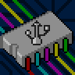
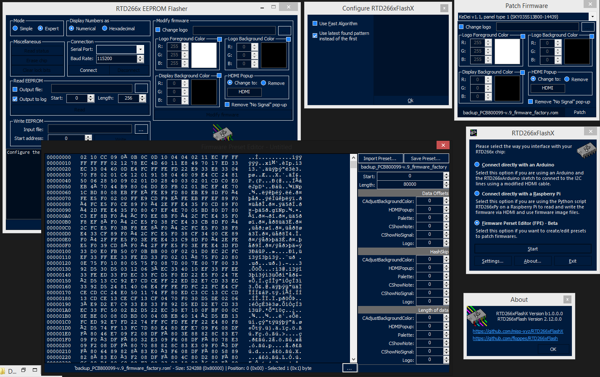
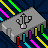
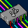
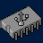

# RTD266xFlashX 
RTD266xFlashX is an improved version of RTD266xFlash, Introducing multiple features aswell as fixing others (see more below)

This repository only contains changes made to the C# application, for anything else please see the original application this version is based on

# Main Changes
<pre>
- Updated design & look
- Custom Firmware Preset System
- Firmware Preset Editor
- Faster Algorithm to detect firmwares (needs work, enable it by going in the 'Options' menu)
</pre>

# Back-end Fixes
<pre>
- Better error messages
- Improved Analyzer
</pre>

# ToDo
<pre>
- Custom Pattern System
- In-App Updater
- Improvements in the faster algorithm
</pre>

# Faster Algorithm
This algorithm is used to find a matching firmware preset with a given firmware binary, it is currently in early stages however it is way faster than the original algorithm, this is because instead of generating and comparing SHA128 hashes, this algorithm compares byte arrays, comparing known patterns with bytes from the input firmware which depend on the offset given by the current HashSkip

# Custom Firmware Preset
This allows for presets to be easily edited and used in the app, aswell as being able to share them to others. Instead of known firmwares being hardcoded, they're now small .ini files, usually with the sample firmware's hash as their filename. They can be generated using/by the In-App Preset Editor or by analyzing a firmware.

You can download the default ones in the releases section of this page, named "base_firmwares.zip".
To install them, just extract the archive in a folder named `'firmware_presets'` in the application's directory.

# Updated Design & Look
I've edited the application front-end a lot, making it look nicer without being over the top, intensive or generic, i've also designed the icons & animations, which were based on a shell32.dll icon (icon id 13).

  
Image Gallery

   
   
   
   
   

# Credits
- <a href="https://github.com/floppes/">floppes</a> - <a href="https://github.com/floppes/RTD266xFlash">RTD266xFlash</a>
- <a href="https://sourceforge.net/projects/hexbox/">Be.Windows.Forms.HexBox</a>
