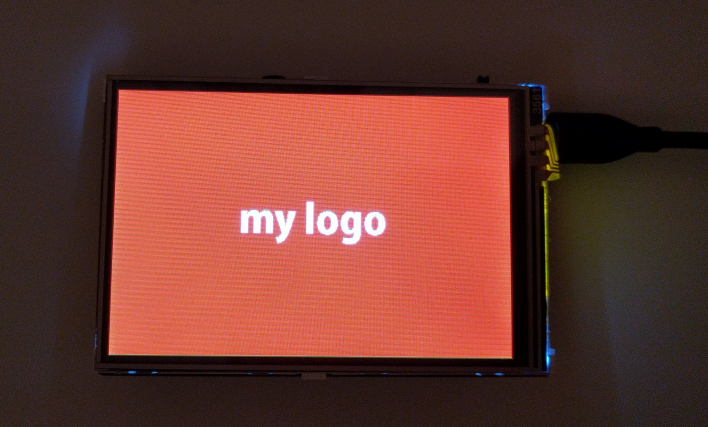
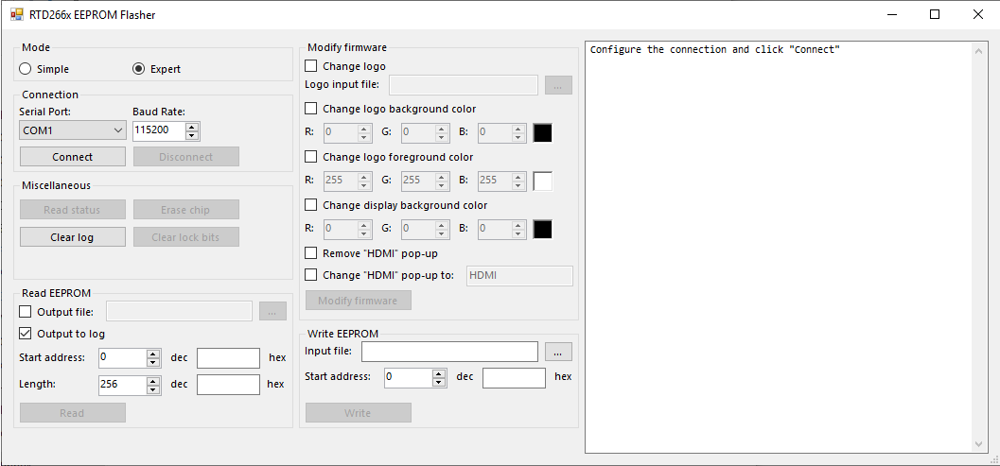
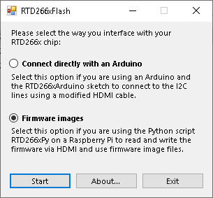
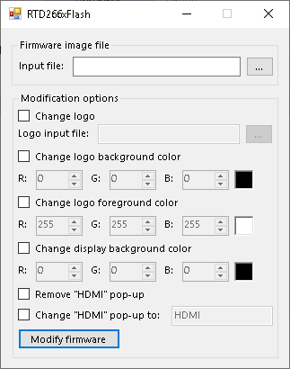

# RTD266xFlash #

This is a combination of an Arduino sketch, a Python script and a C# GUI application to read and write the firmware of the Realtek RTD266x flat panel display controller. The Arduino code is based on [ladyada's project](https://github.com/adafruit/Adafruit_RTD266X_I2CFlasher).

There are special features included for a 3.5" HDMI display manufactured by KeDei, which is equipped with an RTD2660: you can replace the boot logo with a custom logo, change the background and foreground colors and modify the "HDMI" pop-up. The custom logo needs to be 204x72 pixels and may only contain black and white pixels.

## Usage ##

In order to modify the RTD266x's firmware, you need to establish a connection to the chip. There are two ways to do that:

1. You can connect the display via HDMI to a Raspberry Pi, enable the I²C HDMI driver and read/write the firmware using the Python script without any additional hardware. The firmware will be stored in a file which you can open and modify with the C# GUI tool. The modified file is then written back to the display with the Python script.

2. You connect an Arduino to the display's I²C pins using a modified HDMI cable. The Arduino is connected to a PC/laptop and controlled with the C# GUI tool.

If you don't have Microsoft Visual Studio to compile the C# GUI tool, you can download the EXE file from the [releases](https://github.com/floppes/RTD266xFlash/releases).

### Method 1: Arduino ###

Compile the RTD266xArduino sketch with the Arduino IDE and download it onto your Arduino. You can close the Arduino IDE afterwards.

#### Connecting ####

The communication between display and Arduino is done via I²C which is accessible on the VGA and HDMI ports of RTD266x. Connect SCL, SDA and GND with the corresponding Arduino pins.

For an Arduino Uno and an HDMI connector type A, this would be:

| Pin name | Arduino Uno | HDMI type A |
| --- | --- | --- |
| SCL | A5 | 15 |
| SDA | A4 | 16 |
| GND | GND | 17 |

There are no additional pull-ups required, they are already on the RTD266x PCB.

Connect the display and Arduino as mentioned above. Power on the display first, then the Arduino.

A flashing user LED on the Arduino indicates a problem with the connection. Reset the Arduino to try again and use the GUI tool to read the error info.

#### GUI tool ####

Start RTD266xFlash.exe and select **Connect directly with an Arduino**. Select the COM port your Arduino is connected to and click **Connect**. If there was an error it will tell you what went wrong. You can click **Read status** to check the connection and read some info about the flash chip. It should return values different from 0x00 and 0xFF. If it doesn't, try again or reset the Arduino.

#### Ruby tool ####

Instead of the GUI tool written in C#, you can use a Ruby tool on the command line written by [kivikakk](https://github.com/kivikakk).

To read the flash into the file `flash-contents.bin`, call it like this:

`ruby flash.rb SERIAL dump`

Replace `SERIAL` with your serial port (for example `COM1` on Windows, `/dev/ttyACM0` on Linux or `/dev/cu.usbmodem3201` on a Mac).

To write back the firmware, use this command:

`ruby flash.rb SERIAL write FILE [OFFSET LENGTH]`

Call the tool without parameters to get a detailled description of its parameters.

### Method 2: Firmware images with Python script ###

For this method you need a Raspberry Pi running a current version of Raspbian or any derivative. Use a standard HDMI cable to connect the display to the Raspberry Pi. In your `/boot/config.txt` file you need to add the following line to enable the I²C on HDMI interface:

`dtparam=i2c2_iknowwhatimdoing`

You will also need to install the I²C Python library with this command:

`sudo apt-get install python-smbus`

After a reboot, enable the I²C driver by executing:

`sudo raspi-config`

Navigate to `Interfacing Options`, `I2C` and select `Yes`. Use `Back` and `Finish` to leave the configuration tool.

You can then scan for I²C devices with this command:

`sudo i2cdetect -y 2`

It should find a device at address `4a`.

To download the Python scripts, run the following commands:

1. `cd ~`
2. `git clone https://github.com/floppes/RTD266xFlash.git`
3. `cd RTD266xFlash/RTD266xPy`

You are now ready to read the display's firmware with this command:

`python rtd266x_flash.py -r 524288 out.bin`

The number is the firmware's size in bytes (512 x 1024 = 512 KB). This will take about 2 minutes. Transfer the file `out.bin` to your PC/laptop where you have the GUI tool RTD266xFlash.exe. Start it and select **Firmware images**. Select `out.bin` as the input file and configure the modifications you want to perform. Click **Modify firmware** and save the modified firmware file.

Transfer the modified firmware file to the Raspberry Pi and run

`python rtd266x_flash.py -d out.bin out_modified.bin`

where `out_modified.bin` is the modified firmware file. This will write all modified sectors of file `out_modified.bin` to the display, skipping the unmodified sectors to speed things up. Enjoy your modified firmware!

## Expert knowledge: details of firmware modifications ##

**Attention:** Before you modify your firmware, create a backup of the original firmware!

An Intel 8051 MCU is integrated in the RTD266x which runs the firmware. If you compile the source code ([Source 1](https://www.kolins.cz/share/RTD2662) and [source 2](https://github.com/avtehnik/RTD2662)) and set the compiler to output the assembler listings, you can easily find matching code areas within the binary firmware. By manipulating the instructions, we can modify the firmware's behaviour.

Here are some examples for the KeDei 3.5" display. There are different firmware versions for different PCB revisions and panel types. All firmwares are 512 KB. They are assigned numbers to refer to them:

| # | Hardware | MD5 Hash | SHA1 Hash |
|---|---|---|---|
| 1 | PCB V 1.0 | C501EB83693372E1089B096B024F2E9F | 08B253C9B757BC700AFC057F3836878BE866C05C |
| 2 | PCB V 1.1, panel type 1 (SKY035S13B00-14439) | 83B41D1682E7CB7DED3A0241518A3D96 | 1C675660BF478E687CD09912EF77D2A86E93525E |
| 3 | PCB V 1.1, panel type 2 (SKY035S13D-199) v1 | 0FA74E1AF51B56A84AA4D4DD4D97383E | 09E16041E390F9804EA6F734DCB1AACC4A0DC97B |
| 4 | PCB V 1.1, panel type 2 (SKY035S13D-199) v2 | 22AF4BE65892FA772D8699DD030837DC | 3E80A0B3C1DA0E726A1FCF6D31DED497C0B65429 |
| 5 | PCB V 1.1, panel type 3 (SKY035S13E-180) v1 | 906A447A4E0D182669228EC75E581E78 | 9DAC069E130FC7638D90E031C2E36819344703AD |
| 6 | PCB V 1.1, panel type 3 (SKY035S13E-180) v2 | B55F67DA7A609C954EBB75FCDF877F7D | DEC9911C8C1D150D069BAB1D1E42792665E62AD8 |

### Change background color to black ###

The background color is set by calling function `CAdjustBackgroundColor`. For firmware #1 this function is located at 0xD237 - 0xD27A, for firmware #2 at 0xD432 - 0xD475, for firmware #3 at 0xD2A5 - 0xD2E8 and at 0xD2C9 - 0xD30C for firmware #5. At function offsets 0x2C (#1: 0xD263, #2: 0xD45E, #3: 0xD2D1, #5: 0xD2F5) and 0x3C (#1: 0xD273, #2: 0xD46E, #3: 0xD2E1, #5: 0xD305) the instruction is 0xE0 (`MOVX A,@DPTR`). By changing this to 0xE4 (`CLR A`) the background color is always set to 0x000000, which corresponds to black.

### Change logo colors ###

The boot logo uses two colors, which are picked from a color palette consisting of 16 3-byte (red, green, blue) entries. The palette is located at 0x13A31 (firmware #1, #2, #3 and #5). The foreground color is 0xFFFFFF (white) at 0x13A3A. The background color is 0x0000FF (blue) at 0x13A5B. By changing 0x13A5D to 0x00 we can change the background to black.

### Change "HDMI" pop-up text ###

After the display is powered on and has shown it's logo, a small pop-up shows the input source. The text "HDMI" can be changed easily. You won't find the ASCII characters in the firmware, but you can refer to `tGlobalCharWidth` in [OSD/OSD003/OsdRes003.c](https://github.com/avtehnik/RTD2662/blob/master/OSD/OSD003/OsdRes003.c) to decode and encode a string. Some wide characters like A, G, M, W etc. are composed of two font entries. You can find the "HDMI" string by searching for `19 14 1E 1F 1A 00` (offset 0x12346 for firmware #1, #2, #3 and #5). It can be replaced by a custom string but shouldn't be much longer.

### Disable "HDMI" pop-up ###

The "HDMI" pop-up is shown by the function `CShowNote`. It is located at 0x14733 (firmware #1, #2, #3 and #5). By changing it's first instruction at 0x14733 to 0x22 (`RET`), we force an immediate return from this function and no pop-up is shown.