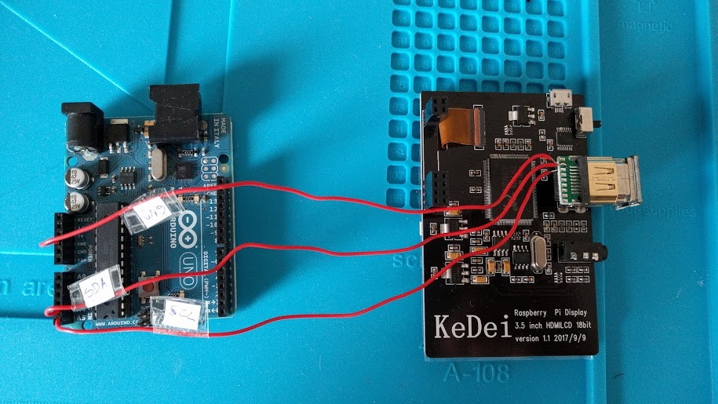
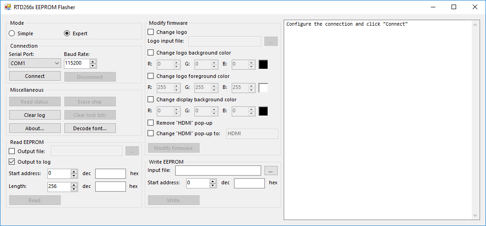

# RTD266xFlash #

This is a combination of an Arduino project and a C# application to read and write the firmware of the Realtek RTD266x flat panel display controller. The Arduino code is based on [ladyada's project](https://github.com/adafruit/Adafruit_RTD266X_I2CFlasher).

There are special features for a 3.5" HDMI display manufactured by KeDei: you can replace the boot logo with a custom logo, change the background and foreground colors and modify the "HDMI" pop-up. The custom logo needs to be 204x72 pixels and may only contain black and white pixels.

## Usage ##

### Arduino ###

Compile the sketch with the Arduino IDE and download it onto your Arduino. You can close the Arduino IDE afterwards.

### Connecting ###

The communication is done via I²C which is accessible on the VGA and HDMI ports of RTD266x. Connect SCL, SDA and GND with the corresponding Arduino pins.

For an Arduino Uno and an HDMI connector type A, this would be:

| Pin name | Arduino Uno | HDMI type A |
| --- | --- | --- |
| SCL | A5 | 15 |
| SDA | A4 | 16 |
| GND | GND | 17 |

There are no additional pull-ups required, they are already on the RTD266x PCB. The display must be powered on.

A flashing LED on the Arduino indicates a problem with the connection. Reset the Arduino to try again and use the GUI tool to read the error info.

### GUI tool ###

If you don't have Microsoft Visual Studio to compile the C# tool, you can download the EXE file from the [releases][releases].

Select the COM port your Arduino is connected to and click **Connect**. If there was an error it will tell you what went wrong. You can click **Read status** to check the connection and read some info about the flash chip. It should return values different from 0x00 and 0xFF. If it doesn't, try again or reset the Arduino.

## Firmware modifications ##

**Attention:** Before you modify your firmware, create a backup of the original firmware!

An Intel 8051 MCU is integrated in the RTD266x which runs the firmware. If you compile the source code ([Source 1](https://www.kolins.cz/share/RTD2662) and [source 2](https://github.com/avtehnik/RTD2662)) and set the compiler to output the assembler listings, you can easily find matching code areas within the binary firmware. By manipulating the instructions, we can modify the firmware's behaviour.

Here are some examples for the KeDei 3.5" display. There are different firmware versions for different PCB revisions and panel types. All firmwares are 512 KB. They are assigned numbers to refer to them:

| # | Hardware | MD5 Hash | SHA1 Hash |
|---|---|---|---|
| 1 | PCB V 1.0 | C501EB83693372E1089B096B024F2E9F | 08B253C9B757BC700AFC057F3836878BE866C05C |
| 2 | PCB V 1.1, panel type 1 (SKY035S13B00-14439) | 83B41D1682E7CB7DED3A0241518A3D96 | 1C675660BF478E687CD09912EF77D2A86E93525E |
| 3 | PCB V 1.1, panel type 2 (SKY035S13D-199) | 0FA74E1AF51B56A84AA4D4DD4D97383E | 09E16041E390F9804EA6F734DCB1AACC4A0DC97B |
| 4 | PCB V 1.1, panel type 3 (SKY035S13E-180) | 906A447A4E0D182669228EC75E581E78 | 9DAC069E130FC7638D90E031C2E36819344703AD |

### Change background color to black ###

The background color is set by calling function `CAdjustBackgroundColor`. For firmware #1 this function is located at 0xD237 - 0xD27A, for firmware #2 at 0xD432 - 0xD475, for firmware #3 at 0xD2A5 - 0xD2E8 and at 0xD2C9 - 0xD30C for firmware #4. At function offsets 0x2C (#1: 0xD263, #2: 0xD45E, #3: 0xD2D1, #4: 0xD2F5) and 0x3C (#1: 0xD273, #2: 0xD46E, #3: 0xD2E1, #4: 0xD305) the instruction is 0xE0 (`MOVX A,@DPTR`). By changing this to 0xE4 (`CLR A`) the background color is always set to 0x000000, which corresponds to black.

### Change logo colors ###

The boot logo uses two colors, which are picked from a color palette consisting of 16 3-byte (red, green, blue) entries. The palette is located at 0x13A31 (firmware #1, #2, #3 and #4). The foreground color is 0xFFFFFF (white) at 0x13A3A. The background color is 0x0000FF (blue) at 0x13A5B. By changing 0x13A5D to 0x00 we can change the background to black.

### Change "HDMI" pop-up text ###

After the display is powered on and has shown it's logo, a small pop-up shows the input source. The text "HDMI" can be changed easily. You won't find the ASCII characters in the firmware, but you can refer to `tGlobalCharWidth` in [OSD/OSD003/OsdRes003.c](https://github.com/avtehnik/RTD2662/blob/master/OSD/OSD003/OsdRes003.c) to decode and encode a string. Some wide characters like A, G, M, W etc. are composed of two font entries. You can find the "HDMI" string by searching for `19 14 1E 1F 1A 00` (offset 0x12346 for firmware #1, #2, #3 and #4). It can be replaced by a custom string but shouldn't be much longer.

### Disable "HDMI" pop-up ###

The "HDMI" pop-up is shown by the function `CShowNote`. It is located at 0x14733 (firmware #1, #2, #3 and #4). By changing it's first instruction at 0x14733 to 0x22 (`RET`), we force an immediate return from this function and no pop-up is shown.